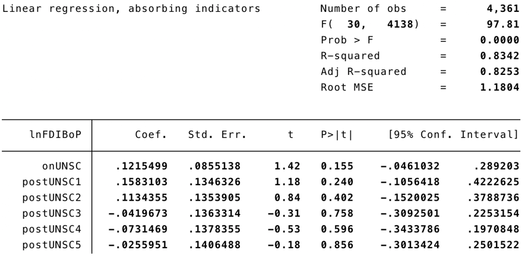
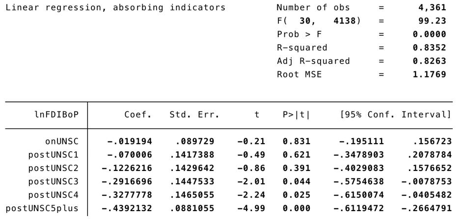
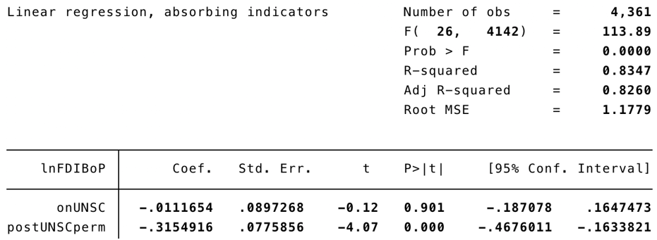

# unsc
## Intro
Investigating effect of non-permanent rotational membership on the United Nations Security Council ion inflow of Foreign Direct Investment (Balance of Payment, US dollars) for a final econometrics group project.

Multiple regression models with fixed effects were used for this analysis. Log-linear transformations were used on the FDI Y-variable in order to be able to interpret coefficients as percentage point changes rather than dollar value changes.

| Variable                          | Observations | Mean     | Std. Err | Min      | Max      |
|-----------------------------------|--------------|----------|----------|----------|----------|
| FDI net inflow (BoP, Current US$) | 4498         | 5.370463 | 18.99977 | -82.8921 | 773.928  |
| ln(FDIBoP)                        | 4361         | 19.77946 | 2.824037 | 2.302585 | 27.32179 |
| Country Name                      | 193          | -        | -        | -        | -        |
| Year                              | 4825         | 2005     | 7.21185  | 1993     | 2017     |

*Table 1: Some summary statistics: panel data was compiled from World Bank and UNSC sources and cleaned*

## Empirical models and results
One important assumption made was that any variables affecting FDI that are also correlated with UNSC membership are “controlled” for by country and year fixed effects incorporated into models, thereby handling omitted variable bias.

Below are some multiple regression models designed for the analysis, and their results: (simpler models not included due to lower R<sup>2</sup><sub>A</sub>

  ### 1. Immediate effects model
  <font size="15"> **Y<sub>it</sub> = 𝛽<sub>0</sub> + 𝛽<sub>1</sub>onUNSC + 𝛽<sub>2</sub>postUNSC1 + 𝛽<sub>3</sub>postUNSC2 + 𝛽<sub>4</sub>postUNSC3 + 𝛽<sub>5</sub>postUNSC4 + 𝛽<sub>6</sub>postUNSC5 + 𝛄<sub>i</sub> + α<sub>t</sub> + ɛ<sub>it</sub>** </font>
    
  * This model consists of 6 dummy variables (generated in Stata from panel data):
      * `onUNSC` indicates whether a country was on the UNSC relative to the year
      * `postUNSC1` indicates if the country is in the first year following membership
      * `postUNSC2` indicating the same as postUNSC1 but for the second year following membership
      * ... and so on until `postUNSC5`
  This model hypothesizes UNSC membership will have an immediate impact on FDI inflow in the five years following membership on the UNSC
  
  ```stata
  xi: areg lnFDIBoP onUNSC postUNSC1 postUNSC2 postUNSC4 postUNSC3 postUNSC5 i.year, absorb(countryname)
  ```
  

  
  ### 2. Fluctuating growth model
  <font size="15"> **Y<sub>it</sub> = 𝛽<sub>0</sub> + 𝛽<sub>1</sub>onUNSC + 𝛽<sub>2</sub>postUNSC1 + 𝛽<sub>3</sub>postUNSC2 + 𝛽<sub>4</sub>postUNSC3 + 𝛽<sub>5</sub>postUNSC4 + 𝛽<sub>6</sub>postUNSC5plus + 𝛄<sub>i</sub> + α<sub>t</sub> + ɛ<sub>it</sub>** </font>

* Same as immediate effects model, but postUNSC5 replaced postUNSC5plus (a variable that
accounts for whether the country has left the UNSC for five years or more, as well as the omitted years before the country’s UNSC membership)

  ```stata
  xi: areg lnFDIBoP onUNSC postUNSC1 postUNSC2 postUNSC4 postUNSC3 postUNSC5plus i.year, absorb(countryname)
  ```


  
  ### 3. Constant growth model
  <font size="15"> **Y<sub>it</sub> = 𝛽<sub>0</sub> + 𝛽<sub>1</sub>onUNSC + 𝛽<sub>2</sub>postUNSC1 + 𝛽<sub>3</sub>postUNSC2 + 𝛽<sub>4</sub>postUNSC3 + 𝛽<sub>5</sub>postUNSC4 + 𝛽<sub>6</sub>postUNSC5plus + 𝛄<sub>i</sub> + α<sub>t</sub> + ɛ<sub>it</sub>** </font>
  
  Unlike the above models, this model uses a second dummy variable that takes on the value 1 for all years following UNSC membership.
  
  ```stata
  xi: areg lnFDIBoP onUNSC postUNSCperm i.year, absorb(countryname)
  ```



